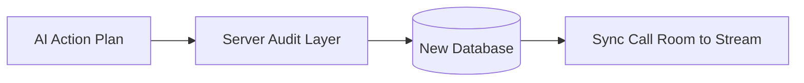

# Governed AI Architecture & Integration Registry

> [!IMPORTANT]
> This registry logs architectural decisions, persistence mappings, and instructions for transitioning to a dedicated database once one is implemented.

---

## 1. Architectural Decisions Log

### 1.1 Secure Server-Side Governance Audits
* **Decision**: All 7 governance protection layers (including role policies, date/user logical validators, and risk assessments) run securely on the server-side Next.js route: `app/api/chat/route.ts`.
* **Rationale**: Moving governance to the server protects the OpenRouter API key, ensures clerk authentication objects can be queried securely on the server (via `currentUser`), and prevents server-only NodeJS dependencies from entering client-side browser bundles.
* **Flow**:
  1. The client sends chat logs and request states to `/api/chat`.
  2. The server calls OpenRouter using the `systemPromptTemplate` guidelines.
  3. If the model proposes an abstract `ActionPlan` (e.g., `createMeeting`), the server intercepts the payload and subjects it to standard audits (`checkPrivacyPolicy`, `ActionPlanner.planAction`).
  4. If approved, the server returns the plan coordinates to the client for safe execution.

### 1.2 Persistence Layer Mapping (Stream Video Client Cache)
* **Decision**: The Stream Video Client (`@stream-io/video-react-sdk`) is used directly as the persistent database and calendar cache layer.
* **Rationale**: There is no dedicated application database implemented yet. When the AI agent successfully plans a meeting, it is directly written as a call room instance via Stream client-side SDK (`client.call('default', id).getOrCreate`).
* **Benefits**: 
  - Zero-dependency real-time scheduling.
  - Newly scheduled AI events immediately populate the upcoming calendar feeds (`useGetCalls()`) and dashboard widgets automatically.

---

## 2. Re-engineering Registry (DB Transition Guide)

When a permanent database (e.g. PostgreSQL, Prisma, MongoDB) is introduced, follow these steps to decouple the cache layer:



### Step 1: Redirect Server-Side Execution Gateway
Navigate to [executionGateway.ts](file:///c:/Users/mark%20vincent/OneDrive/Desktop/Commision/ai-context/gateway/executionGateway.ts) and swap the console mock write inside `executeCreateMeeting` to a formal database transaction:
```typescript
// Replace:
console.log('Gateway executing database write operations safely...', args);
// With:
await db.meeting.create({ data: { title: args.title, startsAt: args.startsAt } });
```

### Step 2: Swap Client-Side Direct Writes
Open [page.tsx](file:///c:/Users/mark%20vincent/OneDrive/Desktop/Commision/app/%28root%29/%28home%29/cast-ai/page.tsx) and redirect the successful `actionPlan` hook. Instead of making client-side `call.getOrCreate` writes directly:
1. Make a POST request to your newly created database API: `/api/meetings/create`.
2. Sync the database entry to the Stream client to provision the room credentials in the background, keeping the calendar fully synchronized.
