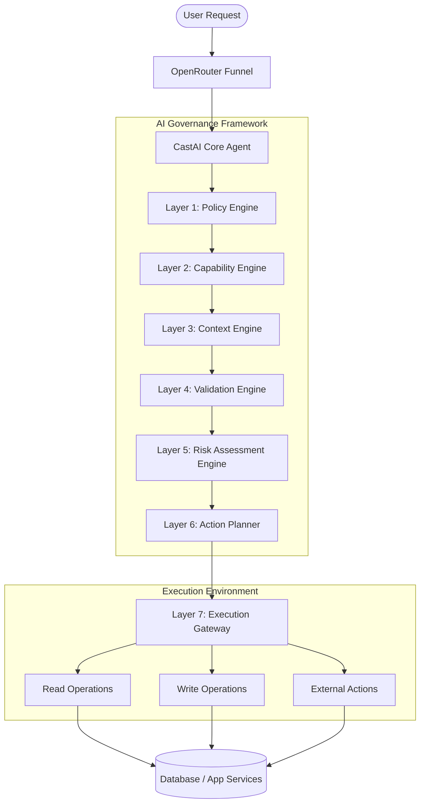

# Governed AI Architecture Principles & Context

This document outlines the strict validation, capability, and policy engine architecture designed to govern all AI actions within CastTalk. Every AI action passes through a multi-layered check before any execution or database interaction is permitted.

---

## 1. System Overview



---

## 2. Governance Layers Spec

### Layer 1: Policy Engine
**Purpose:** Determine whether the AI is allowed to perform the requested action.
* ** privacy.policy.ts**: Controls data exposure limits.
* ** security.policy.ts**: Ensures actions are securely executed within user boundaries.
* ** user.policy.ts**: Validates role permission constraints.
* ** meeting.policy.ts**: Regulates calendar and meeting event permissions.

### Layer 2: Capability Engine
**Purpose:** Define and restrict the boundaries of what the AI is capable of doing.
* **Capabilities Mapping:**
  - `read-all` / `read-meetings` / `read-users`
  - `write-all` / `write-meetings` / `write-users`
* **Boilerplate Implementations:**
  - `createMeeting.ts`
  - `updateMeeting.ts`
  - `cancelMeeting.ts`
  - `sendNotification.ts`

### Layer 3: Context Engine
**Purpose:** Provide full application and user state context.
* ** meeting.context.ts**: Current active meeting metadata.
* ** calendar.context.ts**: User's calendar schedule context.
* ** user.context.ts**: User identity, roles, and profile information.

### Layer 4: Validation Engine
**Purpose:** Verify that generated actions are logically correct.
* **Example:**
  - *AI Proposes:* `Create Meeting` on `2026-07-15`
  - *Validator checks:*
    - `✓` Date is valid and in the future.
    - `✓` Target user exists and is active.
    - `✓` Required meeting fields are present.

### Layer 5: Risk Assessment Engine
**Purpose:** Perform secondary high-impact review before execution planning.
* **Key Assessment Metrics:**
  - Does this action expose private data?
  - Does this affect another user's resources?
  - Is this action destructive or irreversible?
  - Does it violate global policy rules?

### Layer 6: Action Planner
**Purpose:** Convert natural language intent into structured, abstract execution plans.
* **Rules:** No direct database execution or state alteration occurs here.
* **Example Output Schema:**
  ```json
  {
    "action": "createMeeting",
    "arguments": {
      "title": "Capstone Meeting",
      "date": "2026-07-15"
    }
  }
  ```

### Layer 7: Execution Gateway
**Purpose:** The sole component with authorization to write to the database or trigger actions.
* **Boilerplate Gateways:**
  - `executeCreateMeeting()`
  - `executeUpdateMeeting()`
  - `executeSendNotification()`

---

## 3. Strict Execution Rules

> [!IMPORTANT]
> 1. **AI NEVER directly writes to the Database.**
> 2. **AI NEVER directly writes or executes SQL.**
> 3. **AI ONLY generates abstract action plans.**
> 4. **The Action Gateway executes operations only after full validation validation layers have returned a success response.**

---

## 4. Flow Structure Mapping

```
/ai-context
  /policies
    ├── privacy.policy.ts
    ├── security.policy.ts
    └── role.policy.ts
  /capabilities
    ├── createMeeting.ts
    ├── updateMeeting.ts
    └── sendNotification.ts
  /contexts
    ├── meeting.context.ts
    ├── calendar.context.ts
    └── user.context.ts
  /validators
    ├── date.validator.ts
    ├── user.validator.ts
    └── action.validator.ts
  /risk
    ├── privacy.risk.ts
    └── security.risk.ts
  /planner
    └── actionPlanner.ts
  /gateway
    └── executionGateway.ts
  /prompts
    └── systemPrompt.ts
```
